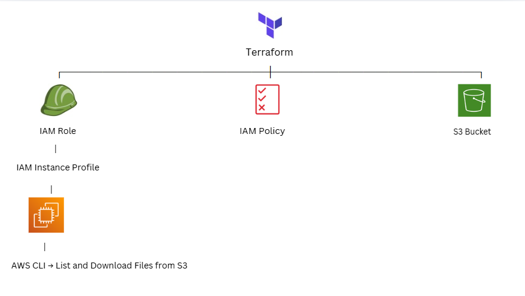
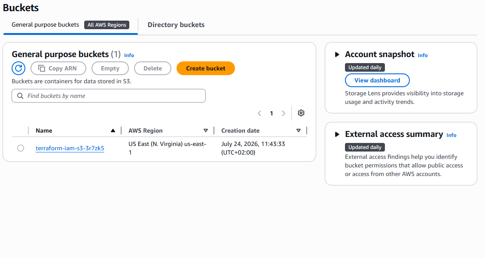
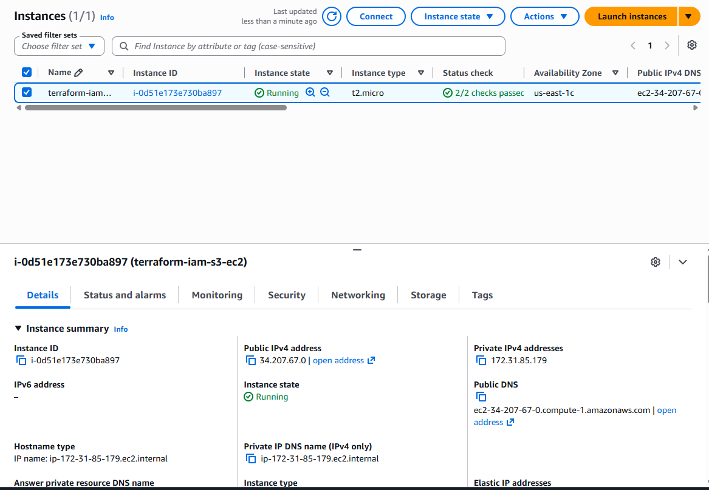
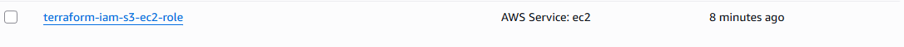
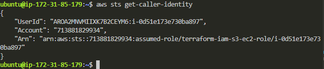
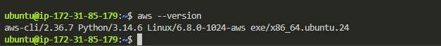
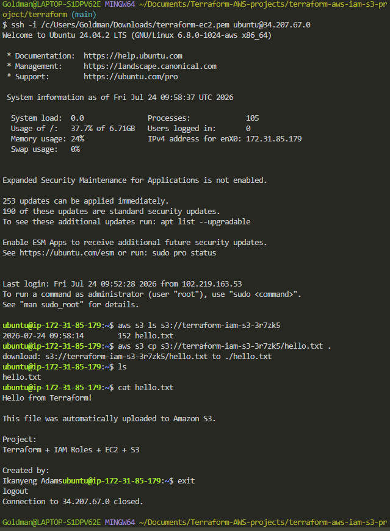
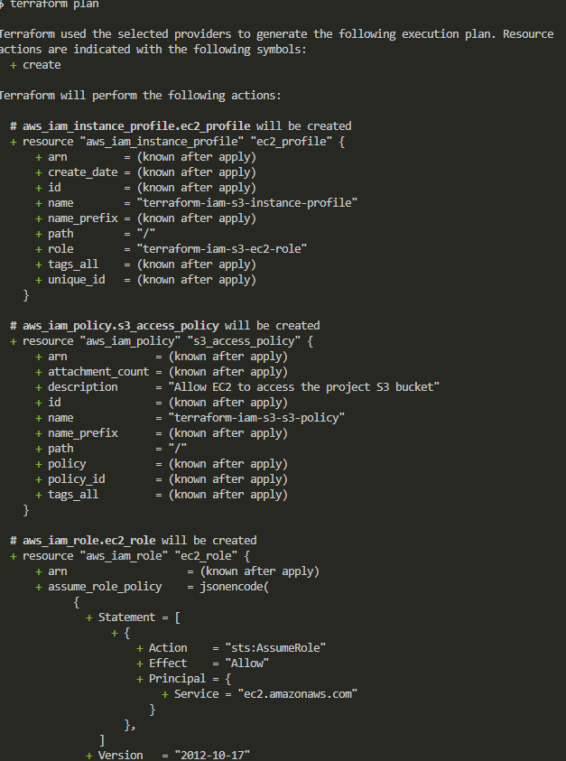
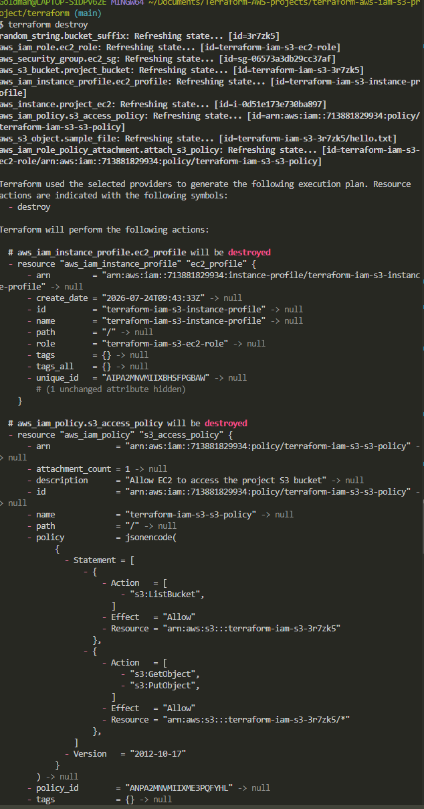

# Terraform AWS IAM + S3 + EC2 Project

## 📖 Overview



This project demonstrates how to provision secure AWS infrastructure using **Terraform** following Infrastructure as Code (IaC) best practices.

The main objective was to learn how **IAM Roles** work with **EC2** to securely access **Amazon S3** without storing AWS Access Keys on the server.

After provisioning the infrastructure, the EC2 instance successfully assumed an IAM Role and used temporary credentials from AWS STS to access an S3 bucket.

---

# 🏗️ Architecture

- Amazon EC2
- Amazon S3
- IAM Role
- IAM Policy
- IAM Instance Profile
- Security Group
- AWS STS
- AWS CLI
- Terraform

---

# 🚀 Infrastructure Created

✔️ S3 Bucket

- Globally unique bucket name generated using the Random provider

✔️ IAM Role

- Trusted by EC2
- Uses STS AssumeRole

✔️ Custom IAM Policy

Permissions granted:

- List S3 Bucket
- Upload Objects
- Download Objects

Only for the project bucket (Principle of Least Privilege)

✔️ IAM Instance Profile

Attached to the EC2 instance to provide temporary AWS credentials.

✔️ EC2 Instance

Ubuntu Server

Automatically installs:

- AWS CLI
- unzip
- curl

using a Terraform user_data script.

✔️ Security Group

Inbound:

- SSH (22)
- Restricted to my public IP

Outbound:

- All traffic

---





# 🔐 Security Best Practices

Instead of using IAM User Access Keys on the EC2 instance, this project uses:

EC2
↓
IAM Instance Profile
↓
IAM Role
↓
AWS STS
↓
Temporary Credentials

No AWS Access Keys were stored on the server.

The IAM Policy follows the Principle of Least Privilege by allowing access to only one S3 bucket.

---



---

# 📂 Project Structure

terraform/
│
├── provider.tf
├── versions.tf
├── variables.tf
├── outputs.tf
├── iam.tf
├── s3.tf
├── ec2.tf
├── random.tf
├── user_data.sh
└── sample.txt

---

# 🧪 Verification

After provisioning:

SSH into EC2

```bash
ssh -i terraform-ec2.pem ubuntu@<PUBLIC_IP>
```

Verify AWS CLI

```bash
aws --version
```

Verify IAM Role

```bash
aws sts get-caller-identity
```

List bucket

```bash
aws s3 ls s3://<bucket-name>
```

Download file

```bash
aws s3 cp s3://<bucket-name>/hello.txt .
```

---








# 🛠️ Technologies Used

- Terraform
- AWS EC2
- Amazon S3
- IAM
- IAM Roles
- IAM Policies
- IAM Instance Profiles
- AWS CLI
- AWS STS
- Git
- GitHub

---

# 📚 What I Learned

- Infrastructure as Code with Terraform
- IAM Roles vs IAM Users
- Trust Policies
- Permission Policies
- IAM Instance Profiles
- Principle of Least Privilege
- Security Groups
- Terraform Providers
- Variables
- Outputs
- Resource Dependencies
- Terraform Dependency Graph
- User Data
- AWS STS Temporary Credentials
- Secure access to AWS services without Access Keys

---

# 📌 Future Improvements

- Create a custom VPC
- Public and Private Subnets
- Internet Gateway
- NAT Gateway
- Route Tables
- Store Terraform State in an S3 Backend
- DynamoDB State Locking
- Terraform Modules
- CI/CD Deployment

---

Created by

**Ikanyeng Adams**

Aspiring Cloud Engineer ☁️